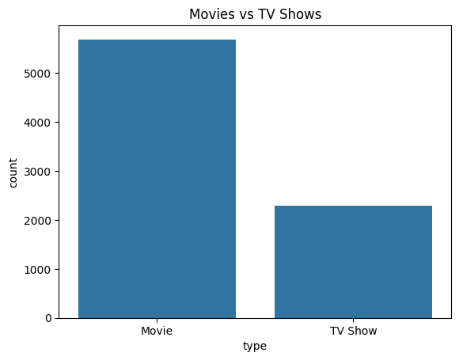
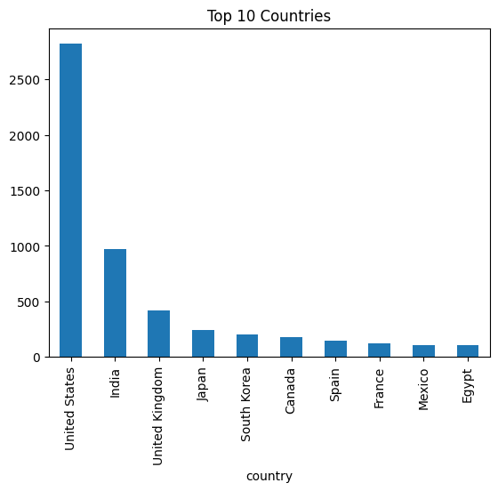
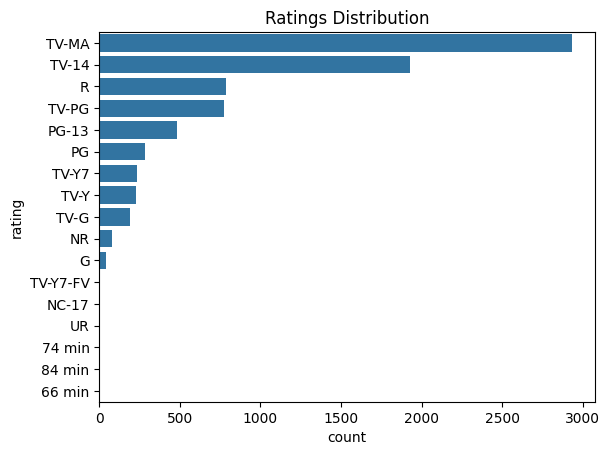
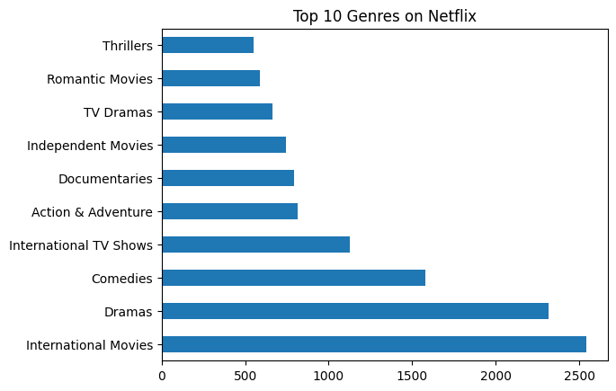

#  Netflix Data Analysis

##  Overview

This project analyzes Netflix movies and TV shows dataset to identify trends, patterns, and insights.

---

##  Analysis Performed

* Movies vs TV Shows comparison
* Top producing countries
* Content growth over years
* Genre distribution
* Ratings analysis

---

##  Key Insights

* Netflix content increased significantly after 2015
* Movies dominate over TV Shows
* USA produces the highest content
* Drama and International genres are popular
* TV-MA is the most common rating

---

##  Visualizations

###  Movies vs TV Shows

###  Top Producing Countries

###  Content Growth Over Years

###  Ratings Distribution

###  Top Genres

---

##  Business Impact

* Helps understand audience preferences
* Supports content strategy decisions
* Identifies growth trends

---

##  Tools Used

* Python
* Pandas
* Matplotlib
* Seaborn

---

## Author

Aparna Padhy

